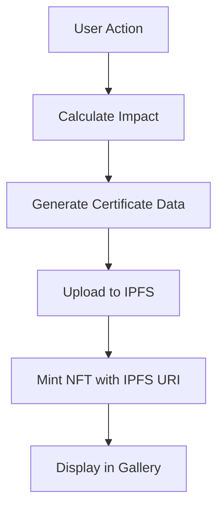

# RANTAI 3C Architecture Documentation

## Overview

RANTAI 3C is a decentralized carbon management platform combining AI-powered analytics, blockchain certification, and IPFS storage. The architecture prioritizes transparency, immutability, and accessibility for Indonesian SMEs.

## System Architecture

### High-Level Architecture

```
┌─────────────────┐
│   Next.js App   │
│   (Frontend)    │
└────────┬────────┘
         │
    ┌────┴────┬──────────┬──────────┬──────────┐
    │         │          │          │          │
┌───▼───┐ ┌──▼──┐  ┌────▼────┐ ┌──▼──┐  ┌────▼────┐
│ IPFS  │ │ Web3│  │ PayPal  │ │Cloud│  │External │
│Storage│ │ RPCs│  │   API   │ │ APIs│  │  APIs   │
└───────┘ └─────┘  └─────────┘ └─────┘  └─────────┘
                         │
                    ┌────▼─────┐
                    │Ethereum  │
                    │Blockchain│
                    │(5 Smart  │
                    │Contracts)│
                    └──────────┘
```

### Component Architecture

The platform consists of three primary layers:

1. **Presentation Layer** - Next.js 15 with TypeScript
2. **Business Logic Layer** - React components, hooks, and utilities
3. **Data Layer** - Blockchain, IPFS, and local storage

## Frontend Architecture

### Technology Stack

- **Framework**: Next.js 15.3.8
- **Language**: TypeScript (strict mode)
- **Styling**: Tailwind CSS v4
- **UI Components**: Custom components + shadcn/ui
- **State Management**: React hooks + localStorage
- **Web3**: ethers.js v6

### Project Structure

```
src/
├── app/                    # Next.js app router
│   ├── api/               # API routes
│   │   ├── health/        # Health check endpoint
│   │   ├── logger/        # Logging endpoint
│   │   ├── me/           # Quick Auth verification
│   │   ├── pinata/       # IPFS upload endpoint
│   │   └── proxy/        # External API proxy
│   ├── layout.tsx         # Root layout with Farcaster metadata
│   ├── page.tsx          # Main dashboard
│   └── globals.css       # Global styles
│
├── components/            # React components
│   ├── ui/               # Reusable UI components (40+ components)
│   ├── AutomatedDataPulling.tsx
│   ├── BlockchainCertification.tsx
│   ├── CarbonAnalysis.tsx
│   ├── CarbonOffsetMarketplace.tsx
│   ├── DataUpload.tsx
│   ├── DataValidation.tsx
│   ├── ExportManager.tsx
│   ├── HistoricalTrends.tsx
│   ├── InteractiveCharts.tsx
│   ├── SustainabilityProgress.tsx
│   ├── WalletConnect.tsx
│   ├── Web3Provider.tsx
│   ├── NFTCertificateGallery.tsx
│   ├── AchievementBadges.tsx
│   ├── CarbonCreditWallet.tsx
│   ├── DAOGovernance.tsx
│   ├── OracleDashboard.tsx
│   └── PaymentModal.tsx
│
├── hooks/                 # Custom React hooks
│   ├── use-mobile.tsx
│   ├── use-toast.tsx
│   ├── useAddMiniApp.ts
│   ├── useIsInFarcaster.ts
│   ├── useManifestStatus.ts
│   └── useQuickAuth.tsx
│
├── utils/                 # Utility functions
│   ├── badgeDefinitions.ts
│   ├── carbonCredits.ts
│   ├── exportUtils.ts
│   ├── governance.ts
│   ├── historyManager.ts
│   ├── ipfsUpload.ts
│   ├── manifestStatus.ts
│   ├── offsetPayment.ts
│   └── oracle.ts
│
├── types/                 # TypeScript type definitions
│   ├── carbon.ts
│   ├── governance.ts
│   └── nft.ts
│
├── contracts/             # Smart contract ABIs
│   ├── CarbonCreditToken.json
│   ├── CarbonDAO.json
│   ├── CarbonOffsetPayment.json
│   ├── CarbonOracle.json
│   ├── NFTCertificate.json
│   └── SoulboundBadge.json
│
└── lib/                   # Libraries and configurations
    ├── logger.ts
    └── utils.ts
```

### Component Patterns

#### 1. Feature Components
Each major feature is encapsulated in a dedicated component:
- Self-contained functionality
- Own state management
- Clear props interface
- Error boundaries

#### 2. Composition Pattern
```typescript
<Web3Provider>
  <WalletConnect>
    <CarbonOffsetMarketplace>
      <PaymentModal />
    </CarbonOffsetMarketplace>
  </WalletConnect>
</Web3Provider>
```

#### 3. Custom Hooks Pattern
Reusable business logic extracted into hooks:
- `useQuickAuth`: Farcaster authentication
- `useAddMiniApp`: Mini app integration
- `useIsInFarcaster`: Context detection
- `use-toast`: Notification system

## Blockchain Architecture

### Smart Contracts

#### 1. Carbon Records Contract
**Purpose**: Store and verify carbon footprint data

**Key Functions**:
- `recordEmission(uint256 amount, string ipfsHash)`
- `getEmissionRecord(address user, uint256 index)`
- `getTotalEmissions(address user)`

**Events**:
- `EmissionRecorded(address indexed user, uint256 amount, uint256 timestamp)`

---

#### 2. NFT Achievement Certificates (ERC-721)
**Purpose**: Mint blockchain-verified achievement certificates

**Key Functions**:
- `mintCertificate(address to, string uri)` - Mint new NFT
- `getCertificateMetadata(uint256 tokenId)` - Get certificate details
- `getUserCertificates(address user)` - Get all user certificates

**Events**:
- `CertificateMinted(address indexed recipient, uint256 indexed tokenId)`

**Metadata Structure** (stored on IPFS):
```json
{
  "name": "Carbon Champion",
  "description": "Achieved 100kg CO2 offset",
  "image": "ipfs://...",
  "attributes": [
    {"trait_type": "Offset Amount", "value": "100"},
    {"trait_type": "Date", "value": "2024-01-15"}
  ]
}
```

---

#### 3. Carbon Credit Tokens (ERC-20)
**Purpose**: Fungible tokens representing verified carbon credits

**Key Functions**:
- `mint(address to, uint256 amount)` - Issue new credits
- `burn(uint256 amount)` - Retire credits
- `transfer(address to, uint256 amount)` - Transfer credits
- `balanceOf(address account)` - Check balance

**Events**:
- `CreditsMinted(address indexed to, uint256 amount)`
- `CreditsRetired(address indexed from, uint256 amount)`

**Token Economics**:
- 1 token = 1 kg CO2 offset
- Burnable upon retirement
- Transferable between accounts

---

#### 4. DAO Governance Contract
**Purpose**: Democratic decision-making for offset projects

**Key Functions**:
- `createProposal(string description, uint256 fundingAmount)`
- `vote(uint256 proposalId, bool support)`
- `executeProposal(uint256 proposalId)`
- `getProposal(uint256 proposalId)`

**Governance Parameters**:
- Voting period: 7 days
- Quorum: 30% of token holders
- Proposal threshold: 1000 tokens

**Proposal Lifecycle**:
```
Created → Active → Voting → Queued → Executed/Defeated
```

---

#### 5. Carbon Offset Payment Contract
**Address**: `0x619971f4F2ED840fB0fCD344c95fc90BE1037c44`

**Purpose**: Handle crypto payments for carbon offset purchases

**Key Functions**:
- `purchaseOffset(string projectId, uint256 offsetAmount, string ipfsHash) payable`
  - Accept ETH payment
  - Record purchase on blockchain
  - Emit purchase event
  
- `getPurchaseHistory(address buyer)` - Returns array of purchases
- `getTotalOffsetAmount()` - Global offset statistics
- `withdrawFunds()` - Owner-only fund withdrawal

**Events**:
- `OffsetPurchased(address indexed buyer, string projectId, uint256 offsetAmount, uint256 amountPaid, uint256 timestamp)`
- `FundsWithdrawn(address indexed recipient, uint256 amount)`

**Payment Flow**:
```
User selects offset → Calculate cost → Send ETH → 
Smart contract records → Emit event → IPFS receipt → 
NFT certificate minted
```

### Network Configuration

**Current Deployment**: Ethereum Sepolia Testnet

**RPC Endpoints**:
- Primary: Alchemy
- Fallback: Infura

**Gas Optimization**:
- Batch transactions where possible
- Efficient data structures
- Event-based data retrieval

## Data Flow

### Carbon Calculation Pipeline

```
User Input → Validation → AI Processing → 
Local Storage → IPFS Upload → Blockchain Certification
```

**Steps**:
1. **Input Collection**: User uploads or imports data
2. **Validation**: Format and range checks
3. **Calculation**: AI-powered emission computation
4. **Storage**: 
   - Local: Quick access
   - IPFS: Decentralized backup
   - Blockchain: Immutable proof
5. **Certification**: NFT minting for achievements

### Certification Flow



### Offset Purchase Flow

```
User selects project → Choose amount → Select payment method →
├─ Crypto: Web3 transaction → Smart contract
└─ PayPal: API call → External processor
→ Record purchase → Upload receipt to IPFS → Mint NFT certificate
```

## Payment Processing

### Dual Payment System

#### 1. Cryptocurrency Payment
**Provider**: Ethereum blockchain via ethers.js

**Flow**:
```typescript
// 1. User connects wallet
const provider = new BrowserProvider(window.ethereum);
const signer = await provider.getSigner();

// 2. Prepare transaction
const contract = new Contract(CONTRACT_ADDRESS, ABI, signer);
const tx = await contract.purchaseOffset(projectId, amount, ipfsHash, {
  value: parseEther(costInEth)
});

// 3. Wait for confirmation
const receipt = await tx.wait();
```

**Advantages**:
- Fully decentralized
- Transparent on-chain records
- No intermediaries
- Lower fees

---

#### 2. PayPal Payment
**Provider**: PayPal REST API

**Flow**:
```typescript
// 1. Create order
const response = await fetch('/api/proxy', {
  method: 'POST',
  body: JSON.stringify({
    protocol: 'https',
    origin: 'api-m.sandbox.paypal.com',
    path: '/v2/checkout/orders',
    method: 'POST',
    headers: { Authorization: `Bearer ${accessToken}` },
    body: { /* order details */ }
  })
});

// 2. User approves on PayPal
// 3. Capture payment
// 4. Record in local database
```

**Advantages**:
- Familiar UX for non-crypto users
- Fiat currency support
- Buyer protection
- Global accessibility

### Payment Security

- **Crypto**: Non-custodial (user controls keys)
- **PayPal**: OAuth 2.0 authentication
- **API Keys**: Server-side only, never exposed to client
- **CORS**: Proxy route prevents direct client-side calls

## Storage Strategy

### Three-Tier Architecture

#### 1. Local Storage (Browser)
**Purpose**: Quick access, offline capability

**Data Stored**:
- User preferences
- Draft calculations
- Session data
- Cached results

**Limitations**: 5-10 MB per origin

---

#### 2. IPFS (Decentralized Storage)
**Purpose**: Permanent, censorship-resistant storage

**Provider**: Pinata

**Data Stored**:
- Carbon calculation records
- NFT metadata
- Certificate images
- Purchase receipts

**Upload Flow**:
```typescript
const formData = new FormData();
formData.append('file', blob);
formData.append('pinataMetadata', JSON.stringify({ name: 'carbon-record' }));

const response = await fetch('/api/pinata/upload', {
  method: 'POST',
  body: formData
});

const { IpfsHash } = await response.json();
// Use: ipfs://${IpfsHash}
```

---

#### 3. Blockchain (Ethereum)
**Purpose**: Immutable proof and verification

**Data Stored**:
- Transaction hashes
- IPFS content identifiers (CIDs)
- Ownership records
- Timestamps

**Data Model**:
```solidity
struct EmissionRecord {
    uint256 amount;
    uint256 timestamp;
    string ipfsHash;
    bool verified;
}
```

## Integration Patterns

### Cloud Provider Integration

**Supported Providers**:
- Google Drive
- Dropbox
- OneDrive

**OAuth 2.0 Flow**:
```
User clicks Connect → Redirect to provider → 
User authorizes → Callback with auth code → 
Exchange for access token → Fetch data → 
Parse and import
```

**API Endpoints**:
- Google Drive: `/drive/v3/files`
- Dropbox: `/2/files/list_folder`
- OneDrive: `/v1.0/me/drive/root/children`

### External APIs

#### Carbon Emission APIs
Mock implementation for demo, designed for:
- Emission factor databases
- Industry benchmarks
- Regional coefficients

#### Oracle Integration
Real-time carbon credit pricing via Chainlink-style oracles:
```solidity
function updatePrice(uint256 newPrice) external onlyOracle {
    currentPrice = newPrice;
    lastUpdate = block.timestamp;
    emit PriceUpdated(newPrice, block.timestamp);
}
```

### Export System

**Formats Supported**:
- CSV: Tabular data
- JSON: Full data structure
- PDF: Professional reports

**Generation**:
```typescript
// CSV Export
const csv = records.map(r => 
  `${r.date},${r.source},${r.amount}`
).join('\n');

// PDF Export (using jsPDF)
const doc = new jsPDF();
doc.text('Carbon Footprint Report', 10, 10);
doc.save('report.pdf');
```

## Security Considerations

### Smart Contract Security

- **Access Control**: Owner-only functions for critical operations
- **Reentrancy Guards**: Protect against reentrancy attacks
- **Integer Overflow**: SafeMath or Solidity 0.8+ built-in protection
- **Input Validation**: Strict parameter checks
- **Event Logging**: Comprehensive event emission for transparency

### Frontend Security

- **XSS Prevention**: React's built-in escaping
- **CORS**: Proxy route for external API calls
- **Environment Variables**: API keys in server-side routes only
- **Type Safety**: TypeScript strict mode
- **Input Sanitization**: Validation before processing

### Payment Security

- **Non-Custodial Wallet**: Users control their own keys
- **HTTPS Only**: All API calls over encrypted connections
- **OAuth 2.0**: Secure PayPal authentication
- **Rate Limiting**: Prevent abuse (to be implemented)
- **Transaction Verification**: On-chain confirmation before updating UI

## Scalability & Performance

### Gas Optimization

- **Batch Operations**: Combine multiple operations where possible
- **Efficient Storage**: Minimize on-chain data, use IPFS for large data
- **Event Indexing**: Use events instead of storage for historical data
- **Upgradeable Contracts**: Proxy patterns for future improvements (to be implemented)

### Frontend Performance

- **Code Splitting**: Next.js automatic splitting
- **Lazy Loading**: Dynamic imports for heavy components
- **Image Optimization**: Next.js Image component
- **Caching**: LocalStorage for frequently accessed data
- **Memoization**: React.memo and useMemo for expensive computations

### Caching Strategy

```
Browser Cache → LocalStorage → IPFS Gateway Cache → Blockchain
```

**Cache Invalidation**:
- Time-based: 24 hours for static data
- Event-based: Blockchain events trigger updates
- Manual: User-initiated refresh

### Bundle Size

**Target**: < 500 KB initial bundle

**Optimization**:
- Tree shaking (automatic with Next.js)
- Minimal dependencies
- Dynamic imports for Web3 libraries
- Tailwind CSS purging

## Monitoring & Observability

### Metrics Tracked

- **Blockchain**:
  - Gas usage per transaction
  - Contract call success rate
  - Block confirmation times
  
- **IPFS**:
  - Upload success rate
  - Pin status
  - Gateway response times
  
- **Frontend**:
  - Page load times
  - API response times
  - Error rates

### Error Handling

**Layers**:
1. **User-Facing**: Toast notifications with actionable messages
2. **Logging**: Console errors in development
3. **Fallbacks**: Graceful degradation when services fail

**Example**:
```typescript
try {
  const tx = await contract.purchaseOffset(...);
  await tx.wait();
  toast.success('Purchase successful!');
} catch (error) {
  console.error('Purchase failed:', error);
  toast.error('Transaction failed. Please try again.');
}
```

## Deployment Architecture

### Vercel Configuration

**Platform**: Vercel Edge Network

**Build Settings**:
- Framework: Next.js
- Build Command: `npm run build`
- Output Directory: `.next`
- Install Command: `npm install`

**Environment Variables**:
```
NEXT_PUBLIC_PINATA_JWT=<pinata_api_key>
NEXT_PUBLIC_PAYPAL_CLIENT_ID=<paypal_client_id>
NEXT_PUBLIC_ALCHEMY_API_KEY=<alchemy_key>
```

### CI/CD Pipeline

**Automatic Deployment**:
- Push to `main` → Deploy to production
- Push to `develop` → Deploy to preview
- Pull Request → Deploy to preview URL

**Build Checks**:
- TypeScript compilation
- Linting (ESLint)
- Type checking
- Build success

### Domain & DNS

- **Production**: Custom domain (to be configured)
- **Preview**: Vercel auto-generated URLs
- **SSL**: Automatic via Vercel

## Future Considerations

### Planned Enhancements

1. **Enterprise Features**:
   - Multi-user organizations
   - Role-based access control
   - Bulk operations
   - API access for integrations

2. **Advanced Analytics**:
   - Machine learning predictions
   - Comparative benchmarks
   - Industry insights
   - Custom dashboards

3. **Mobile Apps**:
   - React Native implementation
   - Offline-first architecture
   - Push notifications

4. **Blockchain Enhancements**:
   - Layer 2 scaling (Polygon, Optimism)
   - Cross-chain compatibility
   - Gasless transactions (meta-transactions)

5. **Governance Evolution**:
   - Quadratic voting
   - Delegation mechanisms
   - Proposal templates

### Mainnet Deployment Checklist

- [ ] Smart contract audits (external security firm)
- [ ] Comprehensive test coverage (>90%)
- [ ] Load testing (1000+ concurrent users)
- [ ] Gas optimization review
- [ ] Legal compliance review
- [ ] Bug bounty program
- [ ] Multi-sig wallet for contract ownership
- [ ] Emergency pause mechanisms
- [ ] Monitoring and alerting setup
- [ ] Incident response plan

---

## Contributing

Contributions are welcome! See [CONTRIBUTING.md](./CONTRIBUTING.md) for development guidelines.

## License

This project is part of the RANTAI 3C platform. See repository root for license details.

## Contact

- **GitHub**: [github.com/mrbrightsides/3c](https://github.com/mrbrightsides/3c)
- **Telegram**: [@khudriakhmad](https://t.me/khudriakhmad)
- **Discord**: @khudri_61362
- **Email**: support@rantai3c.com
- **Website**: https://rantai3c.com

---

*Last Updated: January 2025*
