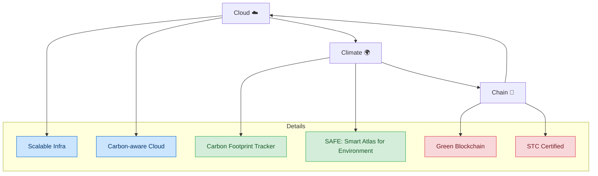

# RANTAI 3C Framework: Cloud, Climate, Chain

## Overview
3C Framework adalah MVP prototipe modular yang menyatukan tiga pilar penting untuk sustainability analytics berbasis blockchain:

Cloud: Infrastruktur data scalable yang menerima dan menyimpan data input dari pengguna (CSV/JSON) sebagai simulasi cloud storage.

Climate: Modul penghitungan dan visualisasi indikator hijau berupa estimasi carbon footprint berdasarkan data input.

Chain: Modul validasi dan pencatatan hasil hitung di blockchain (menggunakan dummy hash atau testnet Ethereum) untuk integritas dan transparansi data.

---

## Goals

- Menyediakan kerangka kerja mudah dipahami dan dikembangkan sebagai proof-of-concept untuk data sustainability yang terukur dan tervalidasi blockchain.

- Menunjukkan integrasi cloud data management, climate impact analytics, dan blockchain verification dalam satu pipeline MVP minimalis.

- Menjadi dasar pengembangan tools dan aplikasi lanjutan dalam komunitas RANTAI.

---

## Features

- Upload data energi/aktivitas dalam format CSV/JSON

- Konversi data input menjadi estimasi carbon footprint

- Visualisasi sederhana (bar chart, pie chart)

- Penyimpanan hasil footprint dengan hash pada blockchain testnet (Sepolia atau dummy)

- Generate sertifikat digital mini "Carbon Aware Record"

- UI flow dengan tab Upload, Analysis, dan Blockchain

---

## Architecture Flow

1. Data Input (Cloud)

  - Pengguna upload file CSV/JSON berisi data konsumsi energi atau aktivitas.

  - Data disimpan dalam simulated cloud bucket storage (backend server atau IPFS stub).

2. Green Metrics (Climate)

  - Sistem menghitung estimasi carbon footprint dari data, misalnya energi (kWh) dikalikan faktor emisi.

  - Data hasil hitung divisualisasikan dalam grafik dan indikator.

3. Certification (Chain)

  - Hasil klaim footprint di-hash dan disimpan di blockchain testnet.

  - Menghasilkan transaction hash yang ditampilkan sebagai bukti verifikasi.

  - Sertifikat digital mini bisa diunduh sebagai bukti carbon awareness.

---

## Flow Diagram

---

## Kontribusi

Kontribusi sangat kami sambut! Silakan ikuti langkah berikut:

- Fork repository

- Buat branch fitur baru: git checkout -b feature/nama-fitur

- Commit perubahan Anda: git commit -m 'Tambah fitur baru'

- Push ke branch Anda: git push origin feature/nama-fitur

- Buat pull request di repository ini

- Harap pastikan kode teruji dan mengikuti style yang sudah ada.

---

## Lisensi

Proyek ini dilisensikan di bawah MIT License - baca file LICENSE untuk informasi lebih lanjut.
