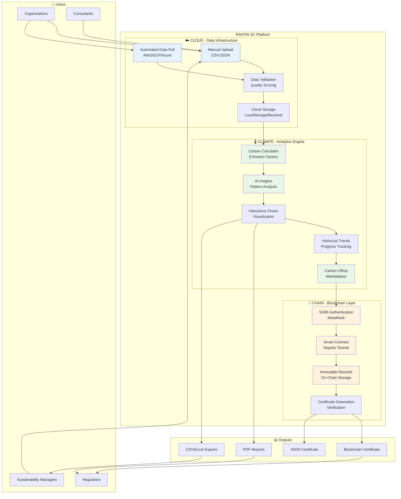
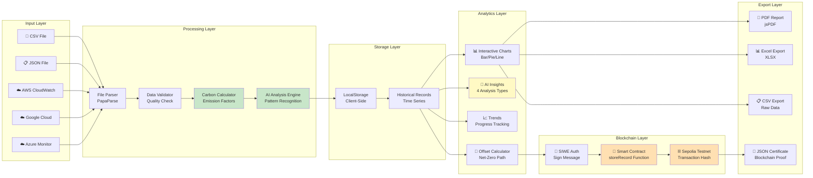
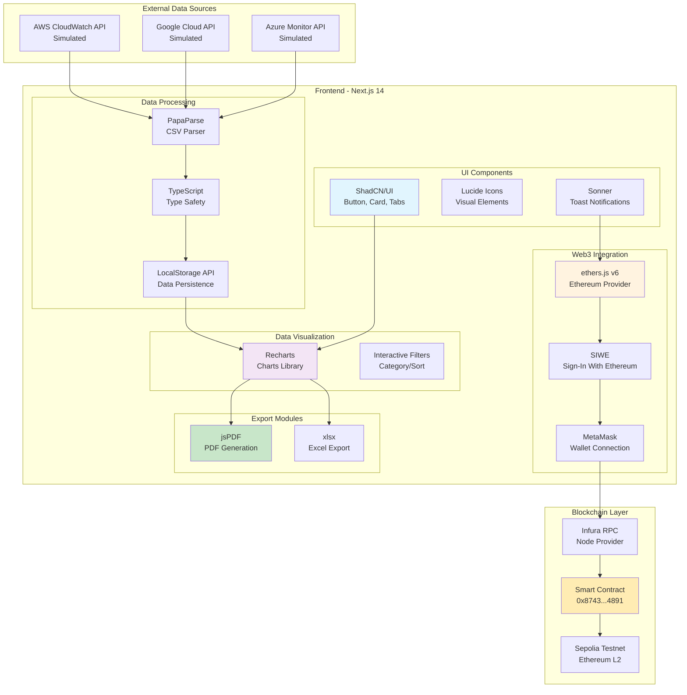
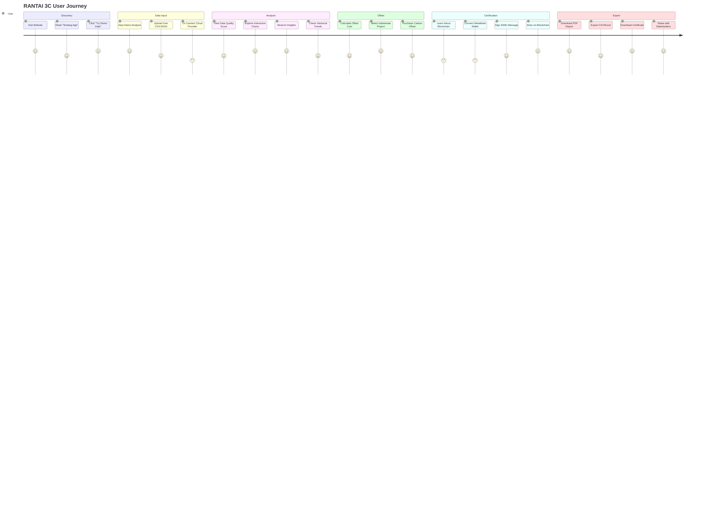
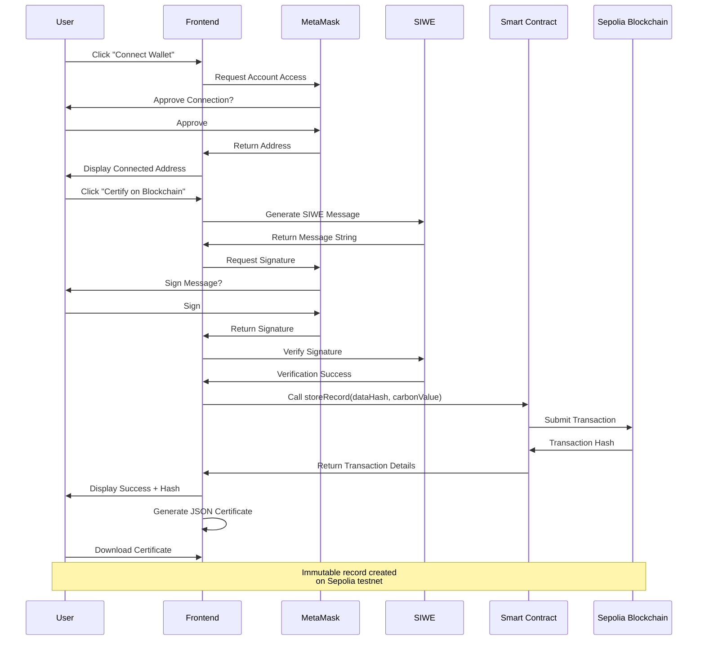
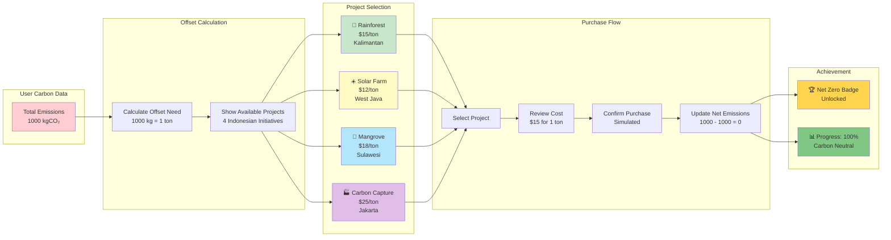
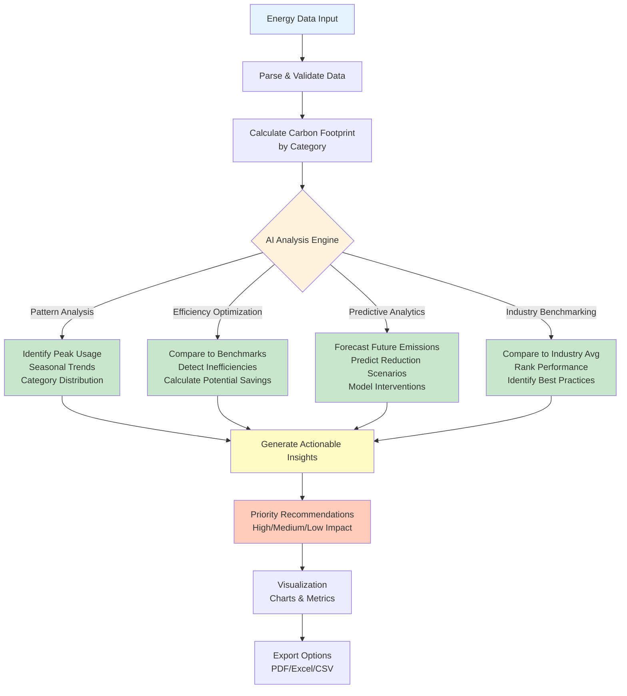
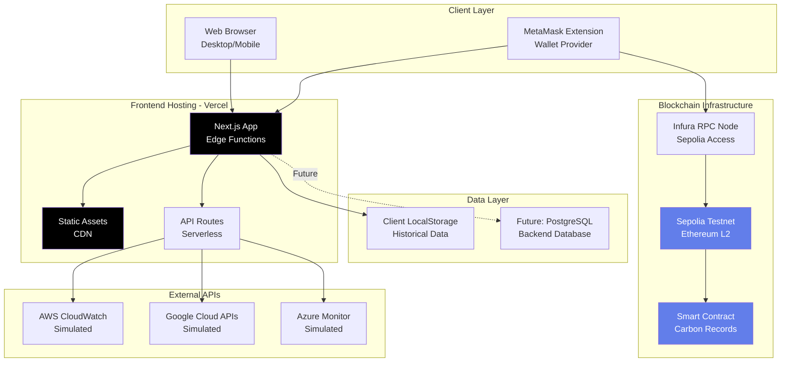
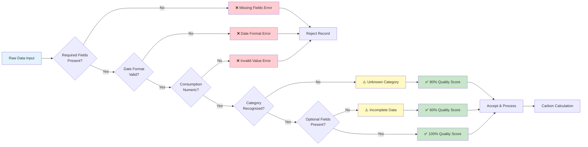
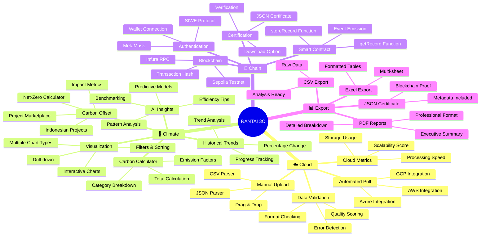

# RANTAI 3C - Architecture Diagrams (Mermaid)

## 1. High-Level System Architecture (3-Pillar Model)

---

## 2. Detailed Data Flow Diagram

---

## 3. Component Architecture (Technical Stack)

---

## 4. User Journey Flow

---

## 5. Blockchain Integration Flow

---

## 6. Carbon Offset Marketplace Flow

---

## 7. AI Insights Generation Process

---

## 8. System Deployment Architecture

---

## 9. Data Quality Validation Pipeline

---

## 10. Complete Feature Map

---

## Usage Instructions

### For Conference Presentation:
- **Slide 1**: Use Diagram #1 (High-Level Architecture)
- **Slide 2**: Use Diagram #2 (Data Flow)
- **Slide 3**: Use Diagram #5 (Blockchain Integration)
- **Slide 4**: Use Diagram #6 (Offset Marketplace)

### For Technical Documentation:
- **Overview**: Diagram #1
- **Implementation**: Diagram #3 (Component Architecture)
- **Deployment**: Diagram #8

### For Poster:
- **Center**: Diagram #1 or #10 (Feature Map)
- **Side panels**: Diagrams #5, #6, #7

### Converting to Images:
1. Use online tools: mermaid.live, mermaid-js.github.io/mermaid-live-editor
2. Or use VS Code extension: "Markdown Preview Mermaid Support"
3. Export as PNG/SVG for high-quality printing

### Styling Tips:
- For dark backgrounds: Add `%%{init: {'theme':'dark'}}%%` at top
- For light backgrounds: Add `%%{init: {'theme':'default'}}%%`
- Custom colors already applied with `style` statements
